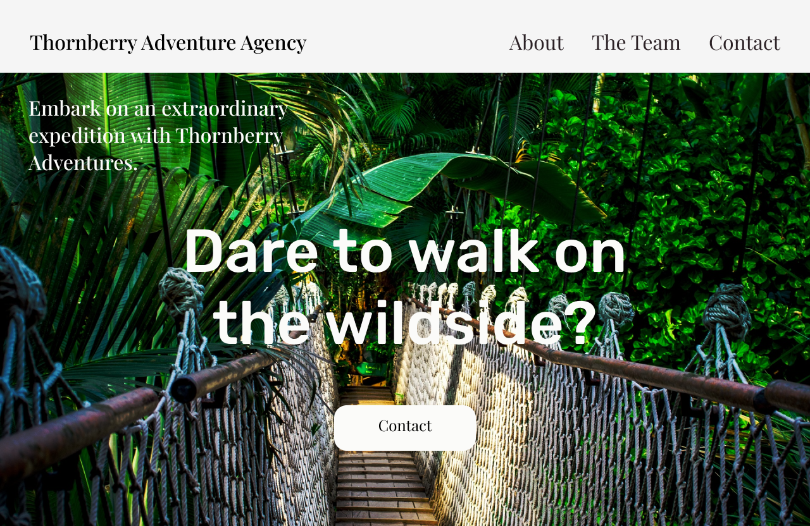
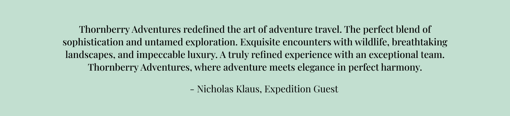
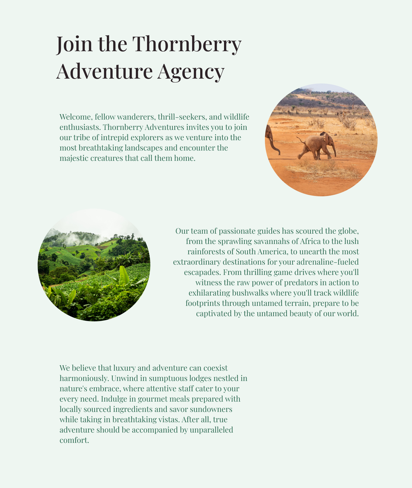
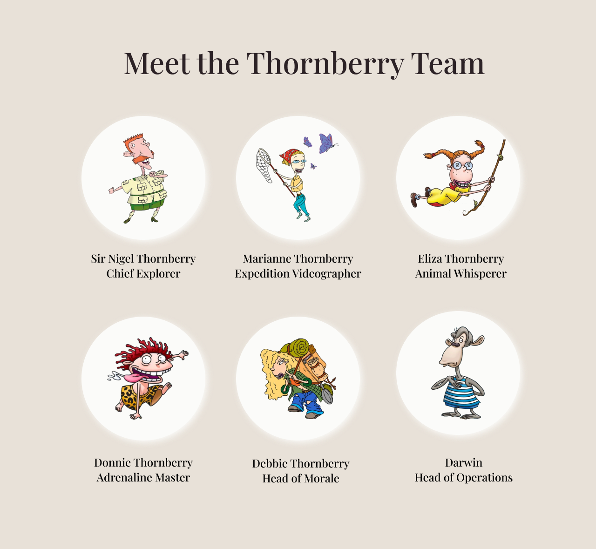
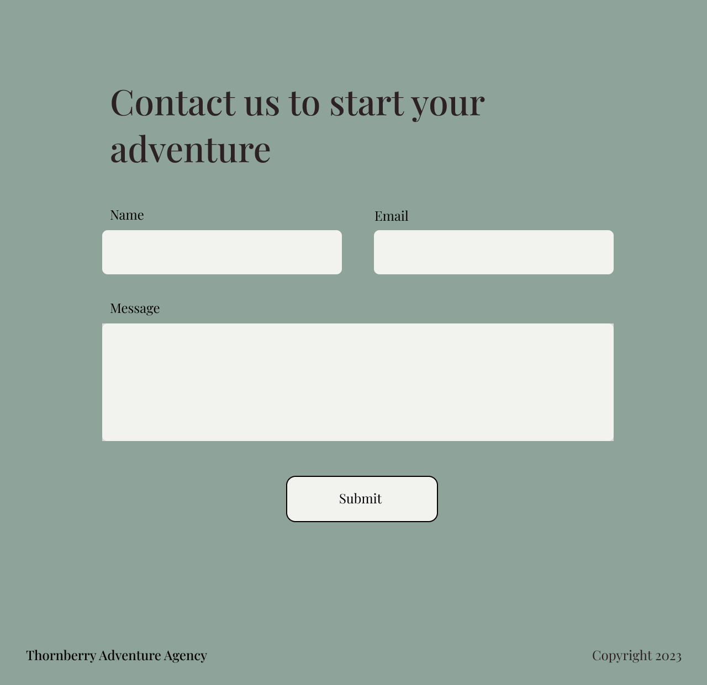

# Thornberry Adventure Agency Website

This README provides an overview of the Thornberry Adventure Agency website hosted at https://fac28.github.io/Thornberry-Adventure-Agency/.

## Table of Contents

1. [Description](#Description) 
2. [Planning](#Planning)
3. [Building](#Building)  
4. [Debugging](#Debugging)
5. [Installation](#Installation)
6. [Usage](#Usage)
7. [Contributing](#Contributing)
8. [License](#License)
9. [Contact](#Contact)

## Description
The Thornberry Adventure Agency website is an online platform that describes the service, team members, and contact options of the Thornberry Adventure Agency, a travel agency specialising in unique adventure tours in the wildest of destinations. The website provides users with information about the agency's adventure tours and helps them plan their next exciting journey.

## Planning
### The Brief
We were given the task of creating an Agency website which contained the following criteria:

- An introduction to your agency
- Information about each member of your team
- A way to get in touch if they are interested in working with you

The user story specified the site needed to include the following:  

- See information about each member of your team so that I can know who you are
- Browse your website on mobile, tablet, and desktop devices
- Click to navigate to different sections of your webpage
- Contact you to enquire about working with you
- Visit your website at a publicly accessible domain name
- Navigate your website using keyboard controls
- Hear my screen reader describe the content on your website
- A user cannot submit a form without filling out all of the mandatory fields (name, company name, email address)
- Information from the form doesn’t get submitted until the user clicks a button

## Building 

We started by mocking up the design of our website on Figma, to give us a starting point:








After we had our brief we divided the workload:
  
1. Set up HTML boilerplate code.
2. Replicate basic CSS styling from mockup design.
3. Add media queries - take mobile-first approach.
4. Create HTML Contact Form
5. Add submitability to Contact Form
6. Create responsive navigation bar. 
7. Convert repeated colours to CSS variables.
8. Add SVG icons to navbar links.
9. Optimise image file sizes.
10. Add button hover/active styling
11. Check site UI has sufficient colour contrast
12. Run site through a screen reader

## Debugging

### Issue - Inline element not styling: 
In the opening section, padding was added to the two headings and the contact link. However, the contact link would not be affected by it. After speaking to others, we realised that the contact link was an inline element, and would need to be changed to inline-block, or block for the padding to affect it.

**Solution:**  

```html
<div class="padding-btwn-text-small center-text">
  <h3>Embark on an extraordinary expedition with Thornberry Adventures.</h3>
  <h1>Dare to walk on the wild side?</h1>
  <a href="#contact" class="button">Contact</a>
</div>
```
```css
#opener div a {
  display: inline-block;
  }

.padding-btwn-text-small > *:not(:first-child) {
    margin-top: 4rem;
  }
```

### Issue - Form label mix-up: 
We ran a Lightbox Report and realised that our labels were mixed up and were impacting our accessibility score. We had accidentally named the label after the input name rather than the id.
```html
<label for="marketingConsent">Are you happy for us to stay in touch?</label>
<input type="checkbox" name="marketingConsent" id="mail-checkbox" />
```

**Solution**
```html
<label for="mail-checkbox">Are you happy for us to stay in touch?</label>
<input type="checkbox" name="marketingConsent" id="mail-checkbox" />
```

### Issue - Site indefinitely expanding to fill large screens: 
The site was displaying as expected on laptops, mobiles, and tablets. However, on large desktop screens the meet the team flex section would expacting to 5 cards in the first row - we didn't want this. We realised we needed to add a container to the site to stop all content from expanding to fill large screens.

**Solution**

Note: _margin: 0 auto;_ centers the contained content.

```css
section > * {
    max-width: 1200px; 
    margin: 0 auto;
}
```

### Issue - Navbar resizing issue. 
Fixed with javascript media queries triggering functions.

**Solution**

```js
// make sure screen resizes don't break sidebar functionality
const mediaQuery = '(max-width: 768px)';
const mediaQueryList = window.matchMedia(mediaQuery);
mediaQueryList.addEventListener('change', event => {
    // mobile display mode
    if (event.matches) {
        // hide nav menu if shown
        if (sideBar) {
            menu.style.display = "flex";
        } else {
            menu.style.transitionDuration = "0.3s";
            menu.style.display = "none";
            tinter.style.display = "none";
        }
    // desktop display mode
    } else {
        const icon = document.getElementById("menu-icon");
        if (icon.classList.contains("change"))
            icon.classList.toggle("change");
        menu.style.transitionDuration = "0s";
        menu.style.display = "flex";
        tinter.style.display = "none";
        sideBar = false;
    }
})
```

## Installation
Access the website on your browswer using the URL: https://fac28.github.io/Thornberry-Adventure-Agency/.

## Usage
The website is designed to provide information about the Thornberry Adventure Agency. Users can navigate through the different sections using the navigation bar at the top or through keyboard controls. Each section provides specific information or features, such as an introduction to the agency, team details, and a contact form.

## Compatibility
The website is designed to be compatible with modern web browsers. It utilizes CSS media queries to provide a responsive layout across different screen sizes.

## Contributing
Contributions to the project are welcome. If you encounter any issues or have suggestions for improvements, please open an issue or submit a pull request on the project's GitHub repository.

## License
The Thornberry Adventure Agency website does not specify a license in the provided repository. Therefore, all rights and ownership belong to the respective creators and maintainers of the website. Please contact the agency for any licensing inquiries.

## Contact
For any inquiries, questions, or support related to the Thornberry Adventure Agency or its website, you can reach out to the creators on GitHub:
- [Issy](https://www.github.com/isobelbutler)
- [Dylan](https://www.github.com/hexmusictheory)

